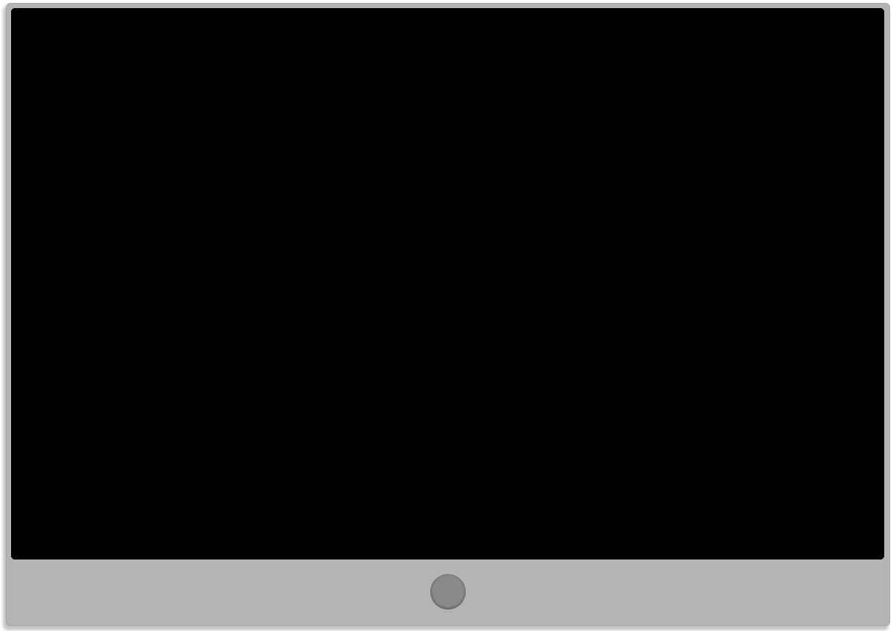

# GH_Television&Remote

[enlace a la página](https://jesusmatinezclavel.github.io/GeeksHub_SecondAssigment_TV-Remote/)

Este proyecto es el segundo trabajo oficial del BootCamp FullStackDeveloper de GeeksHub, y consiste en la creación de una television y un mando que controle los canales que dicha TV muestra. Otros objetivos eran incluir la hora, la fecha, el volumen y el nombre del canal mostrado. Como objetivos extra podíamos añadir un menú selector y un control parental, de los cuales he podido incluir el control de volumen.

[enlace al repositorio](https://github.com/JesusMatinezClavel/GeeksHub_SecondAssigment_TV-Remote?tab=readme-ov-file)

## Tabla de contenidos

1. Sobre el proyecto
2. Sobre el diseño
3. Tecnologías

## 1. Sobre el proyecto

Para este proyecto hemos utilizado JavaScript para crear los eventos que controlarían la televisión a través de los botones del mando a distancia.
Para ello he configurado la pantalla para que tenga varios niveles, en los cuales he puesto por encima la pantalla apagada (en `z-index: 5;`) y al pulsar el botón de encendido se muestre el menú, el cual está en el `z-index: 1;`.

A partir de aquí configuré las teclas del mando para que, dependiendo del número que se pulse afecte al índice del Array correspondiente al Array de canales para así darles (y quitarles) la clase con el correspondiente `z-index: 2;`.
Los niveles `z-index: 3;` y `z-index: 4;` los he utilizado para el botón de menú y el de info respectivamente, para que podamos ir al menu desde cualquier canal y para mostrar la información (fecha, hora y canal seleccionado) siempre que pulsemos el botón.

Para hacer la selección de los canales en el menú he configurado las teclas de la cruceta del mando con un Switch para que cada una se mueva dentro del Array de los canales del menú sumando/restando 1 o 5 al Index y con ello añadiendo y eliminando los elementos de una clase para destacarlos.

Para subir y bajar el volumen y los canales he utilizado el mismo método que con la cruceta del mando, teniendo en cuenta el cambio de función entre los canales del menú y los canales reales.

## 2. Sobre el diseño

Para el diseño he decidido hacer una pantalla sencilla tipo Ipad con un mando a distancia básico.
He añadido algo de profundidad a ambos elementos jugando con los bordes, las sombras y el movimiento, además de apoyar la funcionalidad dada por JavaScript con el pulsado de los botones.

## 3.Tecnologías

Para dar las funcionalidades a los botones he basado todas las funciones a partir de la función para encender la televisión, cambiando el estado de la variable on a true y permitiendo así que funcionen los if/else asociados a los botones, además de tener en cuenta que al volver a pulsar el botón de encendido de la TV debería volver todo a su posición original.

El principal problema que he tenido, sobretodo los primeros días, ha sido el hecho de que las funciones de los botones no me estaban respetando el if/else en el que los había metido, pero tras investigar y hacer varias pruebas comprendí que era mejor declarar las funciones externamente y luego incluirlas en la función de encendido/apagado de la TV, ya que así respetaba el estado de la variable on.

